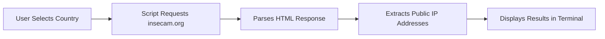

# 🔒 Insecam Viewer


> ⚠️ **IMPORTANT DISCLAIMER**: This tool is for **EDUCATIONAL PURPOSES ONLY**. It demonstrates web scraping techniques and the importance of cybersecurity. Unauthorized access to cameras is ILLEGAL and UNETHICAL. The developer assumes NO liability and does NOT condone illegal activity.

---

## 📋 Table of Contents
- [Overview](#overview)
- [How It Works](#how-it-works)
- [Installation](#installation)
- [Usage](#usage)
- [Features](#features)
- [Legal & Ethical](#legal--ethical)
- [Disclaimer](#disclaimer)
- [License](#license)

---

## 🔍 Overview

**Insecam Viewer** is a Python script that demonstrates web scraping techniques by accessing publicly available information from insecam.org. It serves as a **proof of concept** for:

- Web scraping with `requests` and `re`
- Command-line interface design
- HTTP request handling
- Data parsing and extraction

**THIS IS NOT A HACKING TOOL.** It simply aggregates **ALREADY PUBLIC** information.

---

## ⚙️ How It Works



1. User selects a country from the interactive menu
2. Script sends HTTP requests to insecam.org
3. Parses HTML using regex to find IP:port patterns
4. Displays publicly accessible camera addresses
5. **No passwords are cracked, no systems are breached**

---

## 💻 Installation

```bash
# Clone the repository
git clone https://github.com/yourusername/insecam-viewer.git

# Navigate to directory
cd insecam-viewer

# Install dependencies
pip install requests colorama

# Run the script
python insecam_viewer.py
```

### Requirements
- Python 3.6+
- `requests`
- `colorama`
- Internet connection

---

## 🎮 Usage

```bash
python insecam_viewer.py
```

1. Select a country by entering the corresponding number
2. Wait for results to populate
3. View public IP addresses in terminal
4. Press `Ctrl+C` to exit

**Demo:**
```
OPTIONS : 33
http://123.45.67.89:8080
http://98.76.54.32:554
http://111.222.333.444:8000
...
```

---

## ✨ Features

- 🌍 **145+ Countries** - Wide geographic coverage
- 🎨 **Color-coded Interface** - Enhanced readability
- 🔄 **Auto-update** - Git pull integration
- 📱 **Lightweight** - Minimal dependencies
- 🚀 **Fast Scraping** - Multi-page extraction

---

## ⚖️ Legal & Ethical

### 🚫 **DO NOT USE THIS TO:**
- Access cameras without explicit permission
- Violate anyone's privacy
- Bypass security measures
- Engage in illegal surveillance

### ✅ **ACCEPTABLE USES:**
- Learning web scraping techniques
- Understanding HTTP requests/response
- Studying regex pattern matching
- Security research on sandboxed systems
- Testing your OWN devices

---

## ⚠️ DISCLAIMER

```
THE SOFTWARE IS PROVIDED "AS IS", WITHOUT WARRANTY OF ANY KIND, EXPRESS OR 
IMPLIED, INCLUDING BUT NOT LIMITED TO THE WARRANTIES OF MERCHANTABILITY, 
FITNESS FOR A PARTICULAR PURPOSE AND NONINFRINGEMENT. IN NO EVENT SHALL THE 
AUTHORS OR COPYRIGHT HOLDERS BE LIABLE FOR ANY CLAIM, DAMAGES OR OTHER 
LIABILITY, WHETHER IN AN ACTION OF CONTRACT, TORT OR OTHERWISE, ARISING FROM, 
OUT OF OR IN CONNECTION WITH THE SOFTWARE OR THE USE OR OTHER DEALINGS IN THE 
SOFTWARE.
```

**By using this software, you acknowledge that:**
- You will only use it for ethical, legal purposes
- You are solely responsible for your actions
- The developer assumes no liability
- You understand this is a web scraper, not a hacking tool

---

## 🔐 Security Notes

Many of these cameras are unsecured due to:
- Default passwords never changed
- No authentication configured
- Outdated firmware
- Misconfigured network settings

**If you find YOUR camera listed:**
1. Change default passwords immediately
2. Update firmware
3. Enable authentication
4. Consider network segmentation
5. Disable remote access if not needed

---

## 📚 Educational Value

This project demonstrates:
- `requests` library implementation
- Regex pattern matching (`re.findall`)
- CLI menu systems
- HTTP header manipulation
- Error handling with try/except
- String formatting and color coding
- Git integration basics

---

## 🤝 Contributing

Contributions are welcome for:
- Bug fixes
- Performance improvements
- Better error handling
- Documentation
- **NOT** for enhancing "hacking" capabilities

---

## 📄 License

MIT License - See [LICENSE](LICENSE) file for details

---

## ⭐ Support

If you found this educational, give it a ⭐!  
But remember: **with great power comes great responsibility.**

---

```
┌─────────────────────────────────────────┐
│  EDUCATIONAL USE ONLY                   │
│  Unauthorized access is ILLEGAL         │
│  Respect privacy - secure your devices  │
└─────────────────────────────────────────┘
```

---

**Last Updated:** 2024  
**Author:** King-luiz  
**Purpose:** Cybersecurity Education & Awareness
